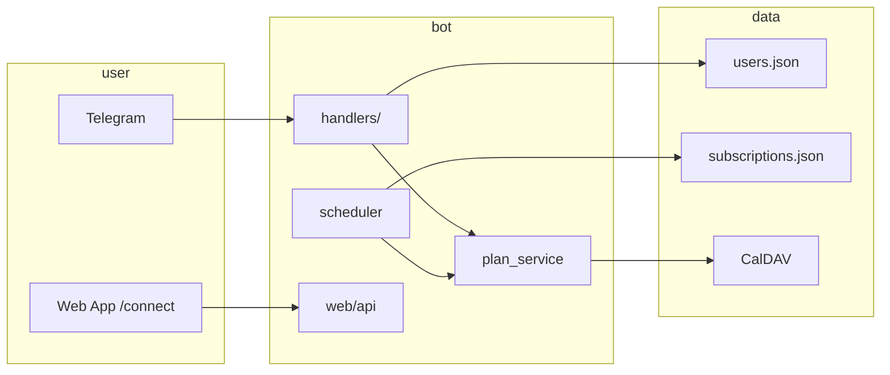

# Документация «Чайка» (Satellite)

Production Telegram-бот: CalDAV → метрики дня → HTML-дайджест в Telegram, per-user
расписание и подключение календаря через Web App.

**Точка входа в код:** [`telegram_test_command.py`](../telegram_test_command.py) →
[`satellite.services.run_bot`](../satellite/services.py).

---

## Содержание

- [С чего начать](#с-чего-начать)
- [Карта документов](#карта-документов)
- [По ролям](#по-ролям)
- [По темам](#по-темам)
- [Вне `docs/`](#вне-docs)
- [Команды разработки](#команды-разработки)

---

## С чего начать

| Шаг | Документ |
|-----|----------|
| Обзор продукта и быстрый старт | [README.md](../README.md) |
| Архитектура слоёв и потоков | [architecture.md](architecture.md) |
| Переменные `.env` и runtime-файлы | [configuration.md](configuration.md) |
| Карта модулей для правок кода | [AGENTS.md](../AGENTS.md) |

---

## Карта документов

| Документ | Назначение |
|----------|------------|
| [architecture.md](architecture.md) | Слои, routing, handlers, CalDAV, дайджест, scheduler, Web App HTTP |
| [configuration.md](configuration.md) | `.env`, валидация при старте, `users.json`, `subscriptions.json`, connect-токены |
| [telegram-ux.md](telegram-ux.md) | Команды, клавиатуры, FSM, streaming, ActionGuard, авторизация сценариев |
| [operations.md](operations.md) | Локальный и серверный запуск, systemd, Docker, CI/CD, reverse proxy, runtime state |
| [testing.md](testing.md) | pytest, `make check`, smoke, release-blocking тесты, фикстуры |
| [design/analytics-orbital-rhythm.md](design/analytics-orbital-rhythm.md) | Визуальная философия и эталон PNG недельной аналитики |
| [troubleshooting.md](troubleshooting.md) | Типичные сбои: env, CalDAV, Web App, дайджест, deploy, миграция logs |
| [refactor-log.md](refactor-log.md) | История архитектурных фаз и инварианты после рефакторинга |
| [test-coverage-audit.md](test-coverage-audit.md) | Сценарий → код → тесты (release-blocking карта) |
| [deploy/README.md](../deploy/README.md) | Ansible, GHCR, секреты Actions, локальный compose |
| [AGENTS.md](../AGENTS.md) | Карта модулей, инварианты, антипаттерны, скрипты — для AI и новых разработчиков |

---

## По ролям

### Разработчик (первый день)

1. [README.md](../README.md) — установка и `make run`
2. [architecture.md](architecture.md) — куда класть логику
3. [AGENTS.md](../AGENTS.md) — «где менять что» и инварианты
4. [testing.md](testing.md) — `make check` перед коммитом

### DevOps / эксплуатация

1. [operations.md](operations.md) — systemd vs Docker, обновление, nginx
2. [deploy/README.md](../deploy/README.md) — `make deploy`, секреты CI
3. [configuration.md](configuration.md) — production `.env`
4. [troubleshooting.md](troubleshooting.md) — диагностика на сервере

### Продукт / UX

1. [telegram-ux.md](telegram-ux.md) — команды, кнопки, тексты сценариев
2. Тексты в коде: [`satellite/messages_ru/`](../satellite/messages_ru/)
3. Шаблоны дайджеста: [`satellite/seagull/templates.py`](../satellite/seagull/templates.py)

### AI-агент (Cursor / Codex)

1. [AGENTS.md](../AGENTS.md) — обязательно перед правками
2. [refactor-log.md](refactor-log.md) — что уже рефакторили
3. [architecture.md](architecture.md) + [testing.md](testing.md) — границы слоёв и регрессии

---

## По темам



| Тема | Где читать |
|------|------------|
| Доступ и заявки | [telegram-ux.md § Access](telegram-ux.md#access-and-calendar-connection), [configuration.md § users.json](configuration.md#пользователи-и-доступ-logsusersjson) |
| Подключение календаря | [architecture.md § Web App](architecture.md#web-app-http), [troubleshooting.md § Web App](troubleshooting.md#web-app-не-открывается) |
| Дайджест плана / непринятых | [architecture.md § Scheduler](architecture.md#scheduler), [configuration.md § Digest](configuration.md#digest) |
| Команды и кнопки | [telegram-ux.md](telegram-ux.md), [AGENTS.md § routing](../AGENTS.md#где-менять-что-типичные-правки) |
| Деплой и CI | [operations.md](operations.md), [deploy/README.md](../deploy/README.md) |
| Тесты и релиз | [testing.md](testing.md), [test-coverage-audit.md](test-coverage-audit.md) |
| Сбои в production | [troubleshooting.md](troubleshooting.md) |

---

## Вне `docs/`

| Файл | Назначение |
|------|------------|
| [README.md](../README.md) | Лендинг репозитория: возможности, быстрый старт, CI |
| [AGENTS.md](../AGENTS.md) | Карта кода для агентов и людей |
| [deploy/README.md](../deploy/README.md) | Docker-деплой (Ansible + GHCR) |
| [.env.example](../.env.example) | Образец переменных окружения |
| [docs/architecture.md](architecture.md) | Подробная архитектура (ссылка из AGENTS) |

### Скрипты

| Скрипт | Документация |
|--------|--------------|
| `scripts/install.sh` | [README § Быстрый старт](../README.md#быстрый-старт) |
| `scripts/install-server.sh`, `bootstrap-server.sh` | [operations.md § systemd](operations.md#развертывание-одной-командой-systemd) |
| `scripts/migrate-legacy-logs.sh` | [operations.md § миграция](operations.md#миграция-systemd--docker-logs-в-volume) |
| `scripts/diagnose_caldav.py` | [troubleshooting.md § CalDAV](troubleshooting.md#команда-работает-но-календарь-пустой) |
| `scripts/diagnose_invitation.py` | [troubleshooting.md § invitations](troubleshooting.md#команда-работает-но-календарь-пустой) |
| `scripts/ci-deploy-remote.sh` | [deploy/README.md](../deploy/README.md), [operations.md § автодеплой](operations.md#автодеплой-из-github-actions) |
| `scripts/docker-smoke-image.sh`, `smoke-prod.sh` | [testing.md § Smoke](testing.md#smoke-образ-и-production-url) |

---

## Команды разработки

```bash
bash scripts/install.sh --dev   # venv + .env + logs/
source venv/bin/activate
make run                          # long-polling бот
make check                        # ruff + mypy + compile + pytest (перед коммитом)
make deploy                       # Ansible → Docker на сервер
make docker-smoke                 # smoke образа
make smoke-prod                   # публичные /healthz, /connect, /api/…
```

Подробнее: [testing.md](testing.md), [operations.md](operations.md).
