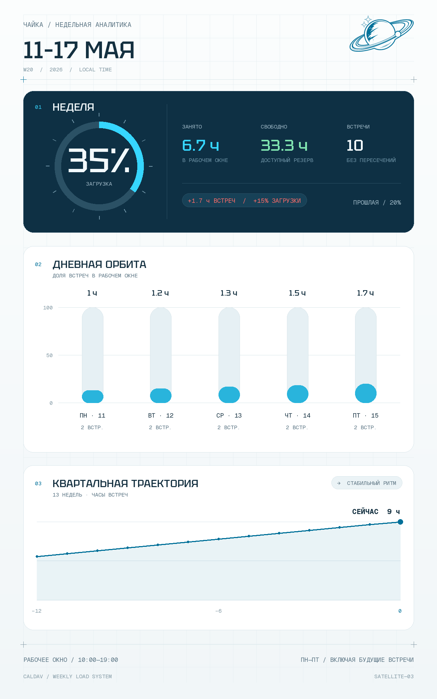

# Светлая орбита

Форма возникает как траектория в ясном небе: крупные окружности удерживают поле, тонкие оси задают направление, а малые отметки превращают воздух в измеримое пространство. Композиция не заполняет поверхность, а бережно калибрует её — каждый интервал кажется найденным после бесчисленных проб и выверенным с мастерской точностью.

Цвет действует как сигнал, а не украшение. Молочно-ледяное поле несёт свет, глубокий синий создаёт единственную точку притяжения, лазурный отмечает движение, а редкий тёплый импульс предупреждает. Палитра должна выглядеть мучительно точно настроенной, как результат долгой работы специалиста на вершине ремесла.

Ритм строится на повторении наблюдений: шкал, точек, делений и следов. Их плотность меняется постепенно, позволяя глазу считывать интенсивность до прочтения подписей. Крупный контрастный жест всегда один; всё остальное остаётся тихим и подчиняется ему с научной дисциплиной и кропотливым вниманием к мельчайшим расстояниям.

Типографика существует внутри системы координат. Слова редки и клиничны, цифры становятся лёгкой архитектурой, а моноширинные пометки работают как следы измерительного прибора. Никаких объяснительных абзацев на самом полотне: смысл передают масштаб, контраст и положение, доведённые до уровня безупречной работы мастера.

Баланс рождается из напряжения между обширным светлым полем и локальной глубиной. Изображение должно ощущаться не созданным мгновенно, а тщательно собранным за многие часы: ясным издалека, невесомым при первом взгляде, вознаграждающим внимательное рассмотрение и сохраняющим пространство для интерпретации при исполнении высшего класса.

## Эталонное выражение

